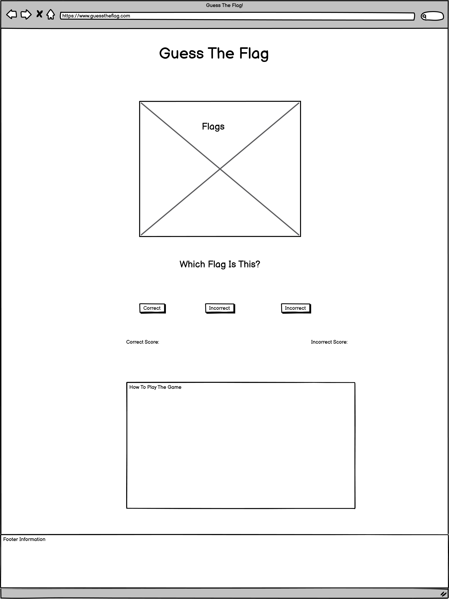

# Guess The Flag

Guess The Flag! It is a fun game in which the player has two minutes to correctly guess as many of the world's flags as they possibly can. They can keep track of their score as they play, as well as how many they have incorrectly guessed.

Link to the live [Guess The Flag](https://totallysly.github.io/portfolio-project-two/)

---

## Table of Contents

- [UX and UI Design](#ux-and-ui-design)
  - [Website Goals](#website-goals)
  - [User Goals](#user-goals)
  - [Potential Features to Use](#potential-features-to-use)
  - [Wireframes](#wireframes)
- [Design](#design)
  - [Imagery](#imagery)
  - [Colour Scheme](#colour-scheme)
  - [Typography](#typography)
- [Features](#features)
  - [Existing Features](#existing-features)
  - [Features Left To Implement](#features-left-to-implement)
  - [Technologies Used](#technologies-used)
- [Testing](#testing)
  - [Validator Testing](#validator-testing)
  - [Manual Testing](#manual-testing)
  - [Accessibility](#accessibility)
  - [Bugs](#unfixed-bugs)
- [Deployment](#deployment)
- [Credits](#credits)
  - [Content](#content)
  - [Media](#media)
  - [Acknowledgments](#acknowledgements)

---

## UX and UI Design

- The planning of this project was kept inline with the five planes of user-centric design. This is to ensure a clean-looking website that is fully responsive. I wanted to quiz that was based on imagery rather than words. This ensures a keen minimalist design, which will be powerful to play on all devices.

- I initially sketched my design using pen and paper. As well as a to-do list of potential features I wanted to implement. When I was happy with my final sketched design, I created my design using the Balsamiq Wireframes program as a solid template for the futures of the website.

---

### Website Goals

    - To provide a fun and interactive game for users using JavaScript
    - To test and improve the knowledge of the users knowledge of world flags.
    - Allow players to see their score increment with, both, correct and incorrect answers.
    - To play against a timer.

---

### User Goals

    - To correctly guess as many counties' flags as they can within a time limit.
    - To improve upon their knowledge of world flags.
    - To have fun!

### Potential Features to Use

    - Increment players scores.
    - A timer feature.
    - Store high scores (locally)
    - Create a username (locally)

---

### Wireframes

Desktop Wireframe

Tablet Wireframe

Mobile Wireframe

---

## Design

### Imagery

- Imagery was sourced from the stock image website, Unsplash. All flag images were sourced from Flagpedia. Both of which are linked below in the content section.

- Images, if required, were compressed using TinyPNG in order to improve website accessibility.

- I link sleek and minimal design. Which I have implemented into this website. Minimal text, and images fuel the process of this website.

---

### Colour Scheme

- I generated this colour palette by uploading the background image onto Coolor's colour palette generator. This is to ensure that the colour scheme remains consistent and aesthetically pleasing. It is cosy and comforting.

---

### Typography

I used Google Fonts to select my fonts.

.

- I chose this font as it I feel it matches the tone of the background image. The globe is old, in an old-fashioned library setting. I wanted a cursive style font to match this design pattern.

- There was a lot of cursive style patterns, but I still wanted to maintain some form of minimist feel. The Bonheur Royale font best suited this aspect. As it is crisp and clear to read, despite being 'old-fashioned cursive'.

---

## Features

### Existing Features

#### Background Image

Background Image

- As soon as I saw this image, I knew it would be perfect for my quiz game. It has a beautiful and calming tone and colours. The magnifying glass peering over the old-fashioned style globe is a great image to represent guessing countries flags.

---

####

---

####

---

####

---

####

---

####

---

####

---

####

---

####

---

####

---

####

---

####

---

### Features Left To Implement

---

## Technologies Used

Languages

- [HTML5](https://en.wikipedia.org/wiki/HTML5)
- [CSS](https://en.wikipedia.org/wiki/CSS)
- [JavaScript](https://en.wikipedia.org/wiki/JavaScript)

Frameworks and Libraries

- [Am I Responsive?](http://ami.responsivedesign.is/)
- [Balsamiq](https://balsamiq.com/)
- [Coolors.co](https://coolors.co/)
- [Font Awesome](https://fontawesome.com/)
- [GitBash](https://gitforwindows.org/)
- [GitHub](https://github.com/)
- [Google Dev Tools](https://developer.chrome.com/docs/devtools/)
- [Google Fonts](https://fonts.google.com/)
- [Responsive PX](http://www.responsivepx.com/)
- [Slack](https://slack.com/intl/en-se/)
- [TinyPNG](https://tinypng.com/)
- [Unsplash](https://unsplash.com/)
- [VS Code](https://code.visualstudio.com/)

---

## Testing

### Validator Testing

---

### Manual Testing

Responsive testing was conducted on a Windows Laptop, iPhone 7, iPhone 7 plus, and a Samsung Galaxy Tab A8. As these devices are limited to their screen sizes. I also tested the responsiveness using Google Dev Tools and [Responsive PX](http://www.responsivepx.com/).

Testing was conducted on Google Chrome, Mozilla Firefox and Safari web browsers.

After website completion, I submitted the website to Code Institute's Slack Community, specifically the 'Peer-Code-Review' channel.

---

### Accessibility

---

### Bugs

---

## Deployment

- The site was deployed to GitHub pages. The steps to deploy are as follows:
- In the GitHub repository, navigate to the Settings tab

  - From the source section drop-down menu, select the Master Branch
  - Once the master branch has been selected, the page will be automatically refreshed with a detailed ribbon display to indicate the successful deployment.

- The link:
  - [Guess The Flag](https://totallysly.github.io/portfolio-project-two/)

---

## Credits

### Content

- Icons where via the amazing website - [Font Awesome](https://fontawesome.com/)
- The colour palette was from [Coolors](https://coolors.co/)
- Additional Responsive Tool [Responsive PX](http://www.responsivepx.com/)
- And of course, Google Dev Tools.

### Media

- My images were from one stock image website: [Unsplash](https://unsplash.com/).

- All flag images were sourced from [Flagpedia](https://flagpedia.net/)

[Background Image - Clay Banks](https://unsplash.com/@claybanks)

### Acknowledgements

---
