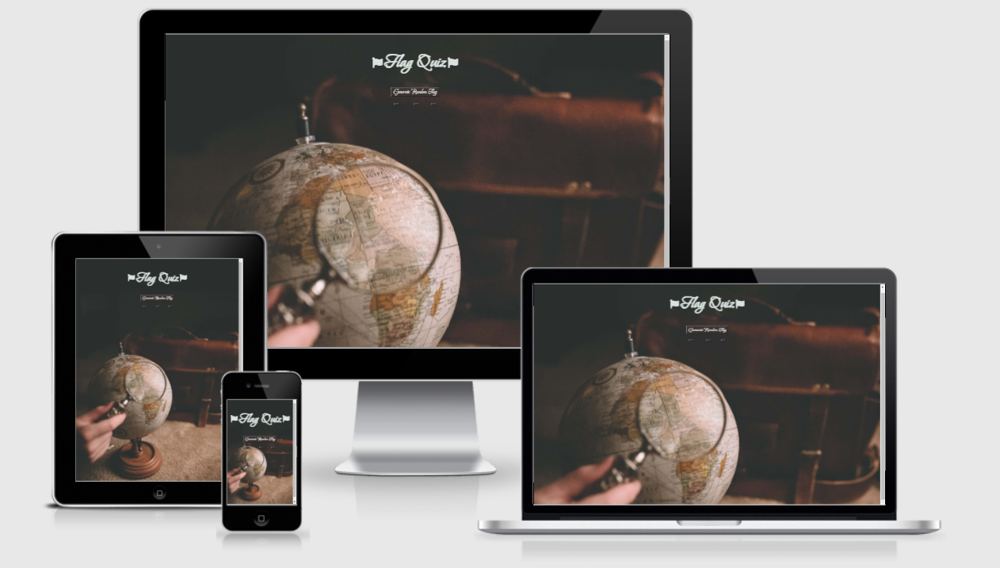
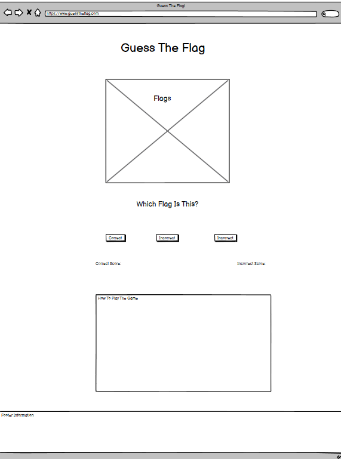
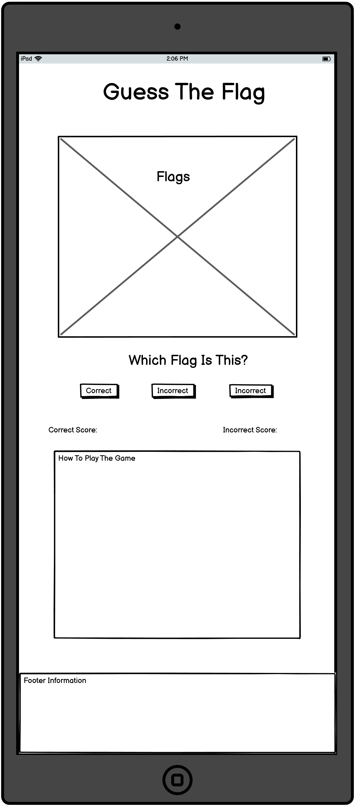
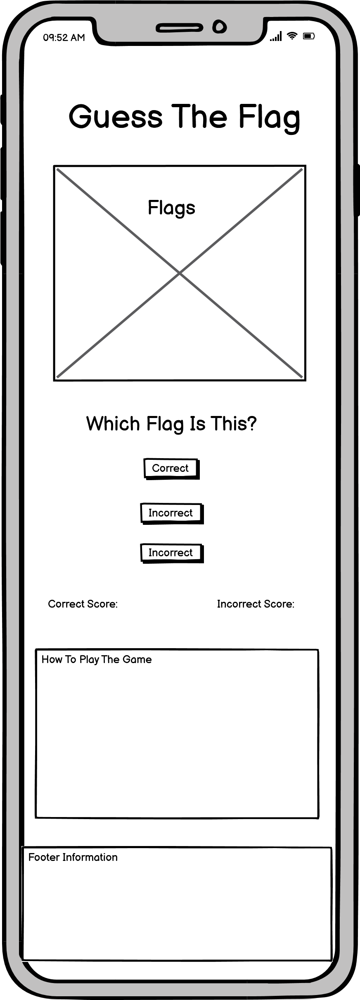
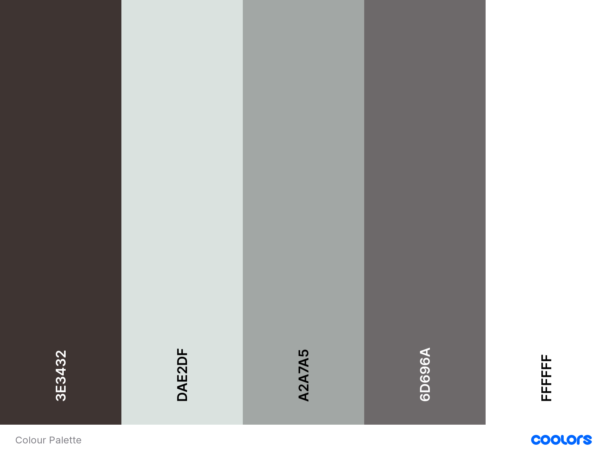
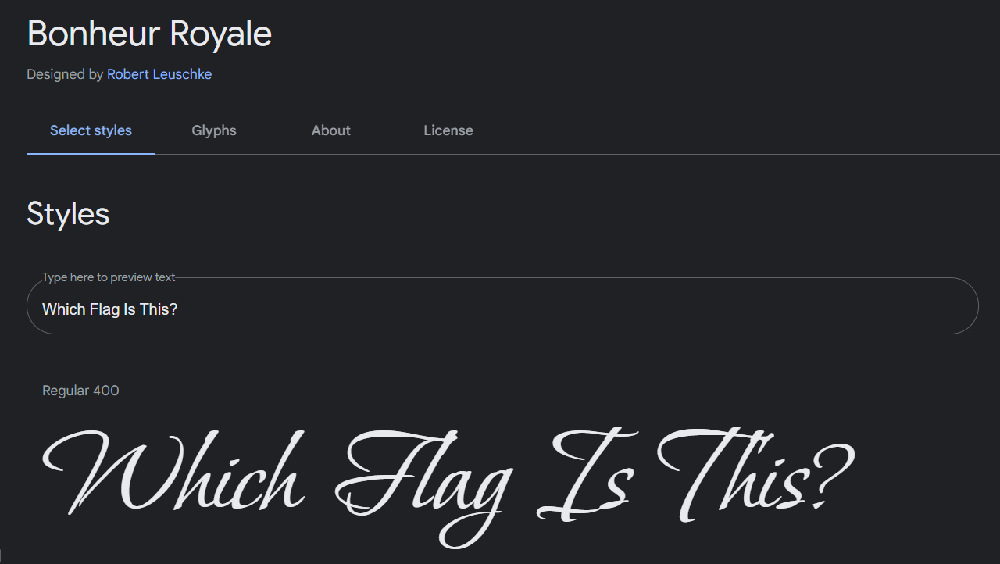
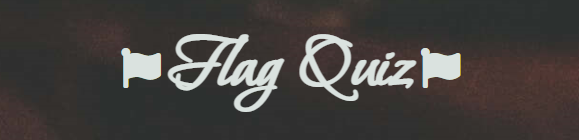
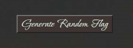
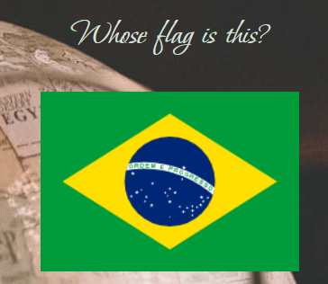
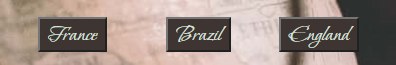

# Guess The Flag

Guess The Flag! Do you know about countries flags?! Well, see how much you actually know!

Link to the live [Flag Quiz](https://totallysly.github.io/portfolio-project-two/)

---

## Table of Contents

- [UX and UI Design](#ux-and-ui-design)
  - [Website Goals](#website-goals)
  - [User Goals](#user-goals)
  - [Potential Features to Use](#potential-features-to-use)
  - [Wireframes](#wireframes)
- [Design](#design)
  - [Imagery](#imagery)
  - [Colour Scheme](#colour-scheme)
  - [Typography](#typography)
- [Features](#features)
  - [Existing Features](#existing-features)
  - [Features Left To Implement](#features-left-to-implement)
  - [Technologies Used](#technologies-used)
- [Testing](#testing)
  - [Validator Testing](#validator-testing)
  - [Manual Testing](#manual-testing)
  - [Accessibility](#accessibility)
  - [Bugs](#unfixed-bugs)
- [Deployment](#deployment)
- [Credits](#credits)
  - [Content](#content)
  - [Media](#media)
  - [Acknowledgments](#acknowledgements)

---

## UX and UI Design

- The planning of this project was kept inline with the five planes of user-centric design. This is to ensure a clean-looking website that is fully responsive. I wanted to quiz that was based on imagery rather than words. This ensures a keen minimalist design, which will be powerful to play on all devices.

- I initially sketched my design using pen and paper. As well as a to-do list of potential features I wanted to implement. When I was happy with my final sketched design, I created my design using the Balsamiq Wireframes program as a solid template for the futures of the website.

---

### Website Goals

    - To provide a fun and interactive game for users using JavaScript
    - To test and improve the knowledge of the users skills in guessing which countries flags relate to which country
    - Allow players to see their score increment with, both, correct and incorrect answers.

---

### User Goals

    - To correctly play an interactive quiz!
    - To improve upon their geography knowledge
    - To have fun!

### Potential Features to Use

    - Increment players scores.
    - A timer feature.
    - Store high scores (locally)
    - Create a username (locally)

---

### Wireframes

Desktop Wireframe

Tablet Wireframe

Mobile Wireframe

---

## Design

### Imagery

- Imagery was sourced from the stock image website, Unsplash. All flag images were sourced from Flagpedia. Both of which are linked below in the content section.

- Images, if required, were compressed using TinyPNG in order to improve website accessibility.

- I link sleek and minimal design. Which I have implemented into this website. Minimal text, and images fuel the process of this website.

---

### Colour Scheme

---

### Typography

I used Google Fonts to select my fonts.

.

---

## Features

### Existing Features

#### Background Image

Background Image

- I felt like this background image was amazing for this project. It gives a nice warm friendly feeling. Almost like a cosy Autumn. The magnifying glass searching for countries is a great addition to the whole concept of the quiz.

---

#### Logo / Heading

Logo

- The logo is a nice and simple design. It is the name of the quiz within two Font Awesome flag icons, of a flag. I felt like this simple design does not distract the user from the quiz at all. but also clearly defines the quiz in itself.

---

#### Generate Flag Button

Generate Flag Button

- The generate flag button is a simple button but with the font of the the website. This is to maintain the same style throughout the website. This button will display a new flag for the user to guess. 

---

#### Flag Question

Flag Question

- The 'whose flag is this' remains consistent through the quiz. It is using the same font family to continue the theme. The flag is generated after the user clicks the 'generate random flag' button. The flag image remains the biggest image on the page, as this is what the user needs to see in order to answer the question.

- The flag is taken from flagpedia.net.

---

#### Option Buttons

Answer Options

The option buttons use the same font as the whole webpage, which is keeping in with the websites theme.

---

### Features Left To Implement

---

## Technologies Used

Languages

- [HTML5](https://en.wikipedia.org/wiki/HTML5)
- [CSS](https://en.wikipedia.org/wiki/CSS)
- [JavaScript](https://en.wikipedia.org/wiki/JavaScript)

Frameworks and Libraries

- [Am I Responsive?](http://ami.responsivedesign.is/)
- [Balsamiq](https://balsamiq.com/)
- [Coolors.co](https://coolors.co/)
- [Font Awesome](https://fontawesome.com/)
- [GitBash](https://gitforwindows.org/)
- [GitHub](https://github.com/)
- [Google Dev Tools](https://developer.chrome.com/docs/devtools/)
- [Google Fonts](https://fonts.google.com/)
- [Responsive PX](http://www.responsivepx.com/)
- [Slack](https://slack.com/intl/en-se/)
- [TinyPNG](https://tinypng.com/)
- [Unsplash](https://unsplash.com/)
- [VS Code](https://code.visualstudio.com/)

---

## Testing

### Validator Testing

---

### Manual Testing

Responsive testing was conducted on a Windows Laptop, iPhone 7, iPhone 7 plus, and a Samsung Galaxy Tab A8. As these devices are limited to their screen sizes. I also tested the responsiveness using Google Dev Tools and [Responsive PX](http://www.responsivepx.com/).

Testing was conducted on Google Chrome, Mozilla Firefox and Safari web browsers.

After website completion, I submitted the website to Code Institute's Slack Community, specifically the 'Peer-Code-Review' channel.

---

### Accessibility

---

### Bugs

- The whole thing.

---

## Deployment

- The site was deployed to GitHub pages. The steps to deploy are as follows:
- In the GitHub repository, navigate to the Settings tab

  - From the source section drop-down menu, select the Master Branch
  - Once the master branch has been selected, the page will be automatically refreshed with a detailed ribbon display to indicate the successful deployment.

- The link:
  - [Flag Quiz](https://totallysly.github.io/portfolio-project-two/)

---

## Credits

### Content

- Icons where via the amazing website - [Font Awesome](https://fontawesome.com/)
- The colour palette was from [Coolors](https://coolors.co/)
- Additional Responsive Tool [Responsive PX](http://www.responsivepx.com/)
- And of course, Google Dev Tools.

### Media

- [Background Image - Clay Banks](https://unsplash.com/photos/b5S4FrJb7yQ).

- [Flag Images](https://flagpedia.net/download)

### Acknowledgements

---
