# Rock, Paper, Scissors

Can you outwit the computer in this classic game of 'Rock, Paper, Scissors'? The game continues for as long as you like. And is a great 5 minute distraction if you are waiting for the bus, the kettle to boil, or sitting on the toilet!

Link to the live website [Rock, Paper, Scissors](https://totallysly.github.io/portfolio-project-two/)

QR Code to View Website

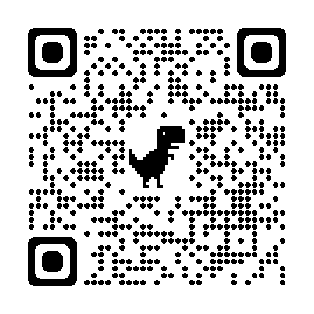

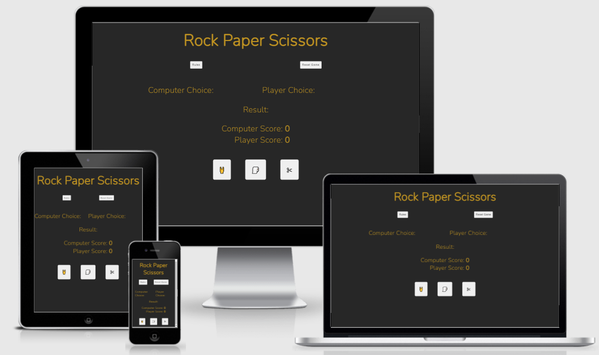

---

## Table of Contents

- [UX and UI Design](#ux-and-ui-design)
  - [Website Goals](#website-goals)
  - [User Goals](#user-goals)
  - [Potential Features to Use](#potential-features-to-use)
  - [Wireframes](#wireframes)
- [Design](#design)
  - [Imagery](#imagery)
  - [Colour Scheme](#colour-scheme)
  - [Typography](#typography)
- [Features](#features)
  - [Existing Features](#existing-features)
  - [Features Left To Implement](#features-left-to-implement)
  - [Technologies Used](#technologies-used)
- [Testing](#testing)
  - [Validator Testing](#validator-testing)
  - [Manual Testing](#manual-testing)
  - [Accessibility](#accessibility)
  - [Bugs](#unfixed-bugs)
- [Deployment](#deployment)
- [Credits](#credits)
  - [Content](#content)
  - [Media](#media)
  - [Acknowledgments](#acknowledgements)

---

## UX and UI Design

- The planning of this project was kept inline with the five planes of user-centric design. This is to ensure a clean-looking website that is fully responsive.

- I initially sketched my design using pen and paper. As well as a to-do list of potential features I wanted to implement. When I was happy with my final sketched design, I created my design using the Balsamiq Wireframes program as a solid template for the futures of the website.

---

### Website Goals

    - To provide a fun and interactive game for users using Vanilla JavaScript
    - To create logic of a Random Number Generator (RNG), for the computer's decision.
    - Allow the scores to increment depending on whether the user or the computer wins.

---

### User Goals

    - To play a game of Rock, Paper, Scissors
    - To kill a few minutes whilst playing this game.
    - The ability to play the computer.
    - To have fun!

### Potential Features to Use

    - Increment players scores.
    - Images instead of text whilst playing the game.
    - Reset the scores instead of hitting the refresh button.

---

### Wireframes

Desktop Wireframe

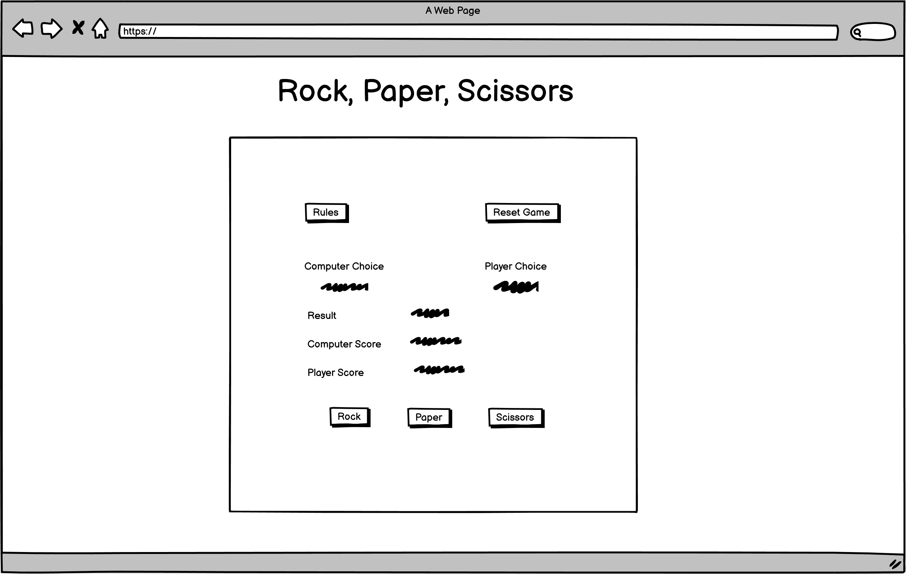

Mobile Wireframe

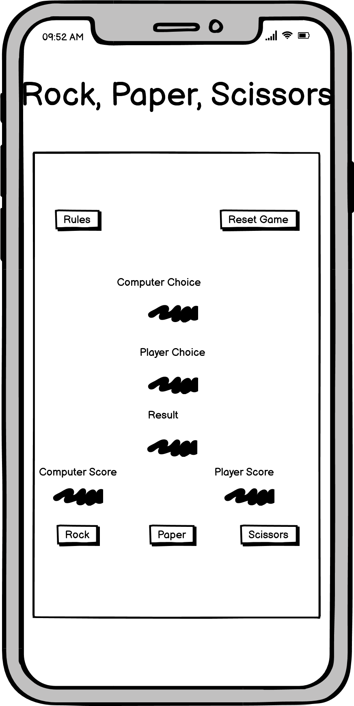

- My wireframes design is very close, but not exactly like the final outcome. This whilst implementing the CSS, the design just didn't feel right. I am a lot more happy with my final outcome.
---

## Design

### Imagery

- The only images used within this project are the pre-installed emoji's. These were tested on Windows and Apple devices and are universal. I felt these images would make the website look contemporary and slightly more unique than using horrible stock images, or over-used Font Awesome icons.

- I link sleek and minimal design. Which I have implemented into this website. Minimal text, and images fuel the process of this website.

---

### Colour Scheme

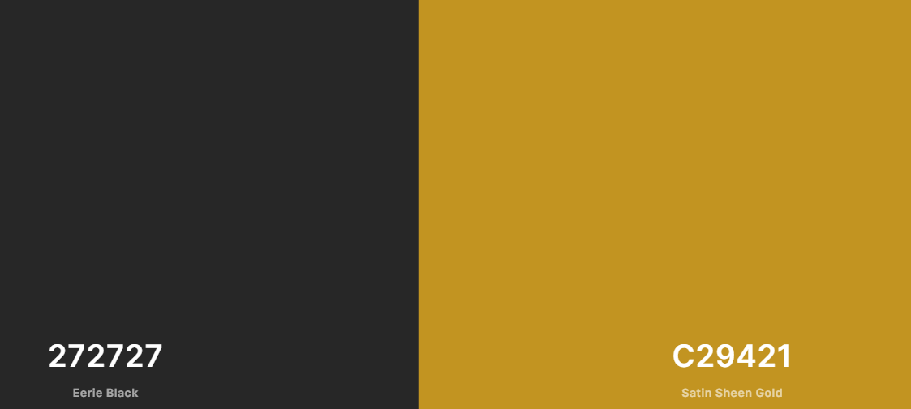

- The shade of black would be a great backdrop to the background of the game.
- The shade of gold is a visually pleasing and warming colour as the font of the game.

---

### Typography

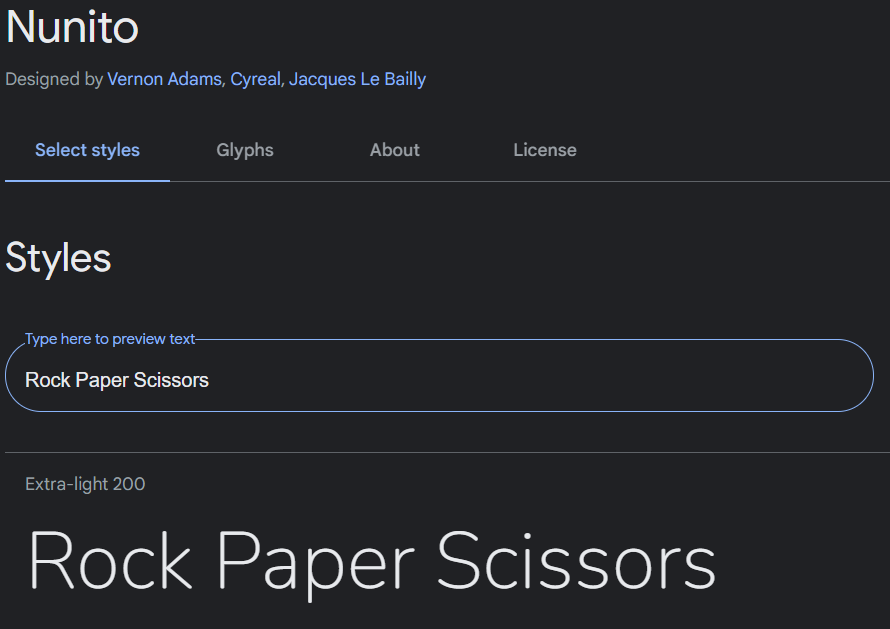.

- I used Google Fonts to select my fonts.
- I fell in love with the 'Nunito' font the second I saw it. I downloaded the file and have set it as a lot of my default font's and am excited to use this font more in the future.

---

## Features

### Existing Features

#### Website Image

Website Image

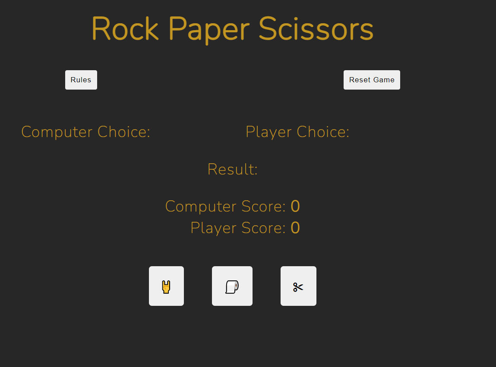

- A simple colour was used as the background image.
- I wanted the game to be minimalist and sleek.

---

#### Logo / Heading

Logo

- The logo is a simple text of 'Rock Paper Scissors' using the 'Nunito' font. I played around with the idea of using the text in conjunction with the emoji's used within the game. However, this was too 'busy'. I also thought about using just emoji's. I opted against this as it made a rather immature looking design. 

---

#### Rules and Reset Game Buttons

Rules and Reset Game Buttons

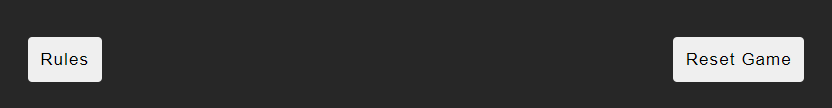

Rules and Reset Game Buttons (Hover)

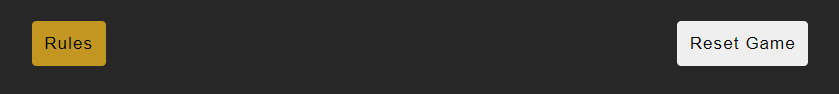

Game Rules

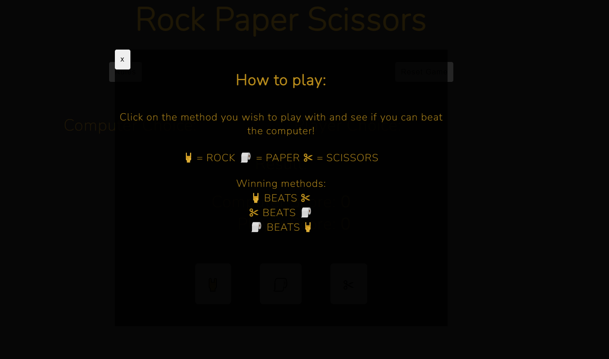

- The game rules open up in a modal, that can be clicked upon at any time during the game.
- The popup stands out from the rest of the game, whilst keeping a sleek design to show the game in the background in a subtle way.
- To shows a 'key' to the user as to what the emoji's represent.
- To shows the user which emoji's beat other emoji's in order to win.
- The 'x' button in the top-left of the modal is visible enough to show the user to close. Like all buttons, when the mouse hovers over this, the background becomes the crisp 'Satin Sheen Gold' colour used in the fonts.

---

#### Game Board

Game Board (Start & Reset Game)

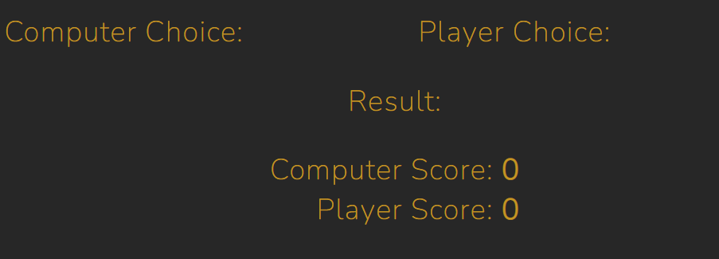

Game Board (During Game)

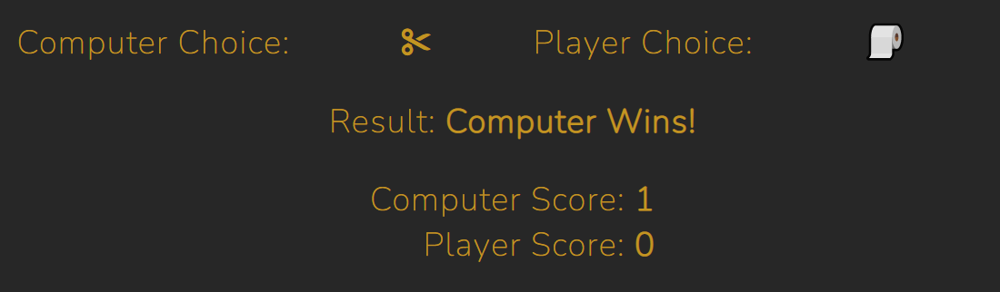

- The Game board before the game is a simple design in which all information can be seen clearly so the player. This is to ensure the user does not have a visual overload of information and can see who wins, what the score is, and play the next round quickly.

- During the game, the choices of the player and the computer are clearly seen. The winner is in a bold font and is in the center of the website. This is so the eyes are can instantly tell who has won the game.

- The score is also in bold, so the numerical value of the score is always clearly seen to the user.

- The Computer and Player is always kept in the same order. First in terms of choice, then in terms of score. This keeps the logic of design flowing.

#### Game Buttons

Game Buttons

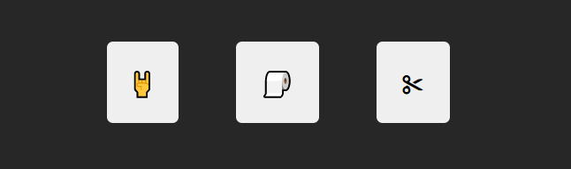

Game Buttons (Hover)

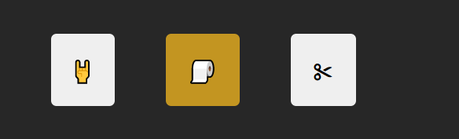

- The Game Buttons are big and stand out clearly to the user. It is clear what each button represents and thus is is intuitive to the user.

- When the user hovers (or on a mobile/tablet, clicks) the buttons change to the font colour. This clearly shows to the user what they are to select. Visually, with the use of the emoji's, this is my favourite section of the website. The emoji's, colours of the button and size. It feels like a modern 8-bit game.

---

### Features Left To Implement

- A high score feature. This will be done by storing the score locally on the players computer.

- Difficulty sections. Normal, hard, harder. The computer would have a larger range of numbers meaning they have a higher chance of winning.
---

## Technologies Used

Languages

- [HTML5](https://en.wikipedia.org/wiki/HTML5)
- [CSS](https://en.wikipedia.org/wiki/CSS)
- [JavaScript](https://en.wikipedia.org/wiki/JavaScript)

Frameworks and Libraries

- [Am I Responsive?](http://ami.responsivedesign.is/)
- [Balsamiq](https://balsamiq.com/)
- [Coolors.co](https://coolors.co/)
- [Font Awesome](https://fontawesome.com/)
- [GitBash](https://gitforwindows.org/)
- [GitHub](https://github.com/)
- [Google Dev Tools](https://developer.chrome.com/docs/devtools/)
- [Google Fonts](https://fonts.google.com/)
- [Responsive PX](http://www.responsivepx.com/)
- [Slack](https://slack.com/intl/en-se/)
- [TinyPNG](https://tinypng.com/)
- [Unsplash](https://unsplash.com/)
- [VS Code](https://code.visualstudio.com/)

---

## Testing

### Validator Testing

---

### Manual Testing

Responsive testing was conducted on a Windows Laptop, iPhone 7, iPhone 7 plus, and a Samsung Galaxy Tab A8. As these devices are limited to their screen sizes. I also tested the responsiveness using Google Dev Tools and [Responsive PX](http://www.responsivepx.com/).

Testing was conducted on Google Chrome, Mozilla Firefox and Safari web browsers.

After website completion, I submitted the website to Code Institute's Slack Community, specifically the 'Peer-Code-Review' channel.

The tested the game logic by writing a list of all possibilities on pen and paper.

---

### Accessibility

Lighthouse - Mobile

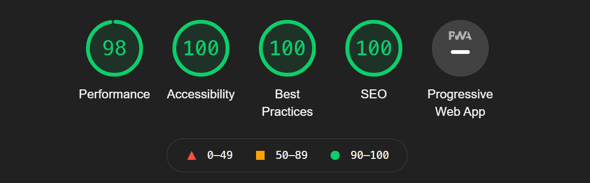

Lighthouse - Desktop

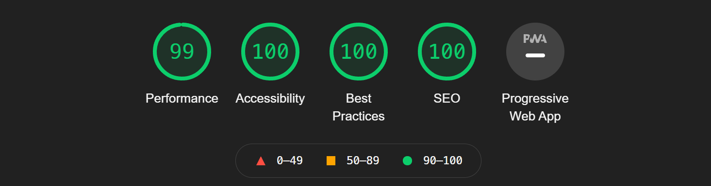

HTML Validation

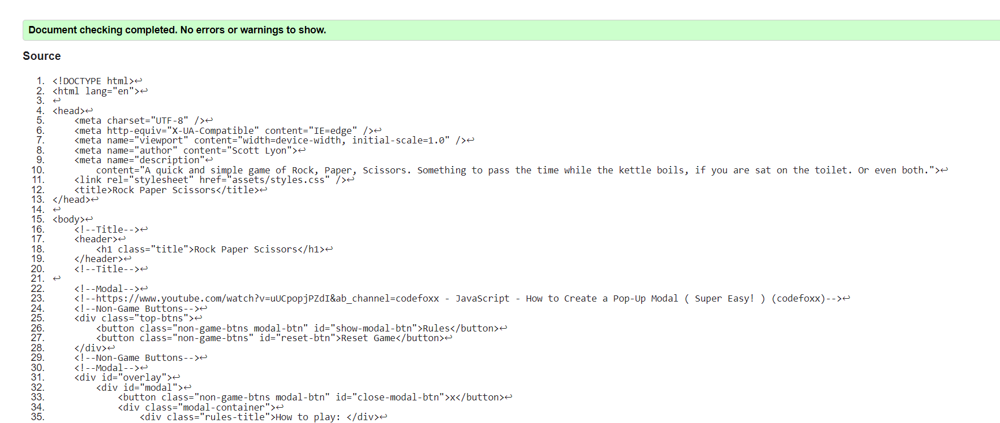

CSS Validation

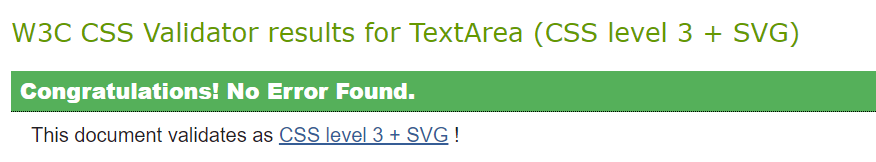

JavaScript Validation

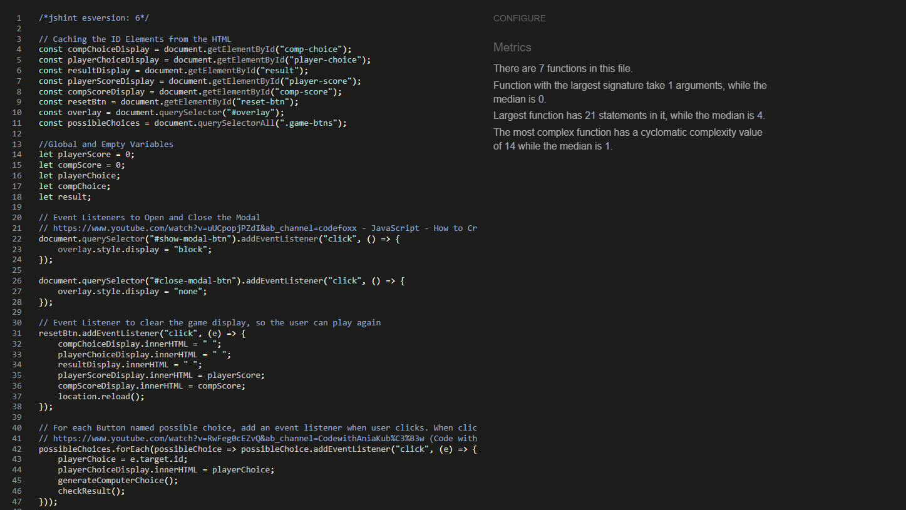

---

### Bugs

- All bugs have now been fixed and are working fully.

Bugs I came across whilst coding the game:

  - #1 Resetting The Score To Be Zero.
    - All parts of the game would reset when the 'Reset Game' button was clicked. However, once the new game would begin. The score would be continued. So instead of starting at zero with the next score being 1, it would become 11. I found a solution on Stack Overflow.
  - #2 Results Not Being Added To The Score. 
    - I found that using the Font Awesome Icons were causing the issue. I believe this was due to the addition "i tags" required within the "button tags". After a lot of debating, I simply tested using the pre-installed emoji's within Window's 10. Not only did this not mess any of the coding when it came to the score being added. It provided a great unique feature. Instead of the boring Font Awesome Icon's I had seen everywhere, I had a USP. It also helped create cool 8 bit looking buttons. A fantastic thinking outside of the box solution if I do say so myself.

---

## Deployment

- The site was deployed to GitHub pages. The steps to deploy are as follows:
- In the GitHub repository, navigate to the Settings tab

  - From the source section drop-down menu, select the Master Branch
  - Once the master branch has been selected, the page will be automatically refreshed with a detailed ribbon display to indicate the successful deployment.

- The link:
  - [Rock Paper Scissors](https://totallysly.github.io/portfolio-project-two/)

QR Code to View Website

---

## Credits

- [How to Create a Pop-Up Modal - (codefoxx)](https://www.youtube.com/watch?v=uUCpopjPZdI&ab_channel=codefoxx) 
  - How to create a modal.

- [location.reload() - Stack Overflow](https://stackoverflow.com/questions/3715047/how-to-reload-a-page-using-javascript)
  - How to reset the local stage of a user's browser.

- [Code with Ania Kubów](https://www.youtube.com/watch?v=RwFeg0cEZvQ&ab_channel=CodewithAniaKub%C3%B3w)
  - General ideas surrounding a Rock Paper Scissors Game. 
  - Direct code for creating a For Each loop regarding Event Listeners.

- [Master JavaScript - Jonas Schmedtman](https://codingheroes.io/)
  - A General course which i used to learn JavaScript.

### Content

- Icons where via the amazing website - [Font Awesome](https://fontawesome.com/)
- The colour palette was from [Coolors](https://coolors.co/)
- Additional Responsive Tool [Responsive PX](http://www.responsivepx.com/)
- And of course, Google Dev Tools.

### Media

Windows 10 pre-installed emojis.

### Acknowledgements

---
